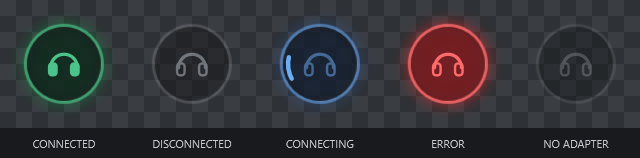
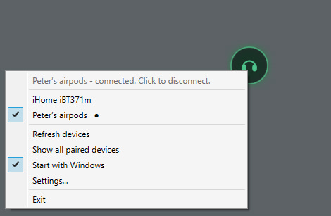

# Bluggle

**Bluetooth toggler.** A 64 px always-on-top widget that connects and disconnects a paired
Bluetooth audio device with one click. Built for Windows 10 (1809+) and Windows 11, x64.

It does the same two things the Connect and Disconnect buttons in Windows' Bluetooth settings
do, and nothing else - so toggling never rebuilds your audio endpoints or loses their settings.
Written with AirPods in mind; it works with any paired Bluetooth audio device.



| Interaction | Result |
|---|---|
| Left click | Toggle: connect if disconnected, disconnect if connected. A chime confirms the connect |
| Left click + drag | Move the widget (5 px threshold, so a click never nudges it) |
| Right click | Device picker, Refresh devices, Start with Windows, Settings, Exit |
| Hover | Widget brightens and grows slightly; tooltip shows the current state |



The right-click menu picks the target device. Paired audio devices are listed with a `●` beside
anything currently connected, and a tick beside the one the widget is pointed at.

---

## Build

Requires the [.NET 8 SDK](https://dotnet.microsoft.com/download/dotnet/8.0).

```bash
dotnet build src/Bluggle/Bluggle.csproj -c Release
```

Run straight from source while you are tweaking things:

```bash
dotnet run --project src/Bluggle/Bluggle.csproj -c Release
```

### Single self-contained .exe

The RID, `SelfContained` and single-file settings already live in the csproj, so the plain
publish command produces one portable executable with no .NET runtime dependency:

```bash
dotnet publish src/Bluggle/Bluggle.csproj -c Release -o src/Bluggle
```

Output: `src/Bluggle/Bluggle.exe`, a single file of roughly 67 MB, sitting next to
the source it was built from. Nothing else is emitted - copy that one file anywhere you like.

If you would rather have a ~1 MB executable and do not mind requiring the
**.NET 8 Desktop Runtime** on the machine:

```bash
dotnet publish src/Bluggle/Bluggle.csproj -c Release -o src/Bluggle --self-contained false -p:PublishSingleFile=true -p:PublishReadyToRun=false
```

> Trimming (`PublishTrimmed`) is deliberately off. WPF resolves types from XAML by reflection,
> so a trimmed build fails at runtime rather than at build time. That 67 MB is the honest cost
> of a zero-dependency WPF app.

Windows SmartScreen will warn the first time you run an unsigned executable. *More info →
Run anyway*, or sign it with your own certificate.

---

## First-time setup

1. Pair your AirPods normally in **Settings → Bluetooth & devices**. This app never pairs
   anything; it only connects and disconnects things you have already paired.
2. Launch `Bluggle.exe`. The widget appears near the bottom-right of your primary
   monitor, greyed out.
3. **Right-click it** and pick your AirPods from the device list. The list shows paired audio
   devices; a `●` marks anything currently connected.
4. Left-click to connect. Expect 2-5 seconds - the ring spins while it works.
5. Drag it wherever you want it. The position is saved automatically, including on a second
   monitor.
6. Optionally right-click → **Start with Windows**.

Everything is stored in `%APPDATA%\Bluggle\config.json`, which is plain, commented-by-name
JSON you can hand-edit. Right-click → Settings → **Open config folder** takes you there.

---

## Troubleshooting

### "Connect does nothing"

In order of likelihood:

- **AirPods are in the case.** They are not connectable with the lid shut. Open it, or take
  them out, and click again.
- **Wrong device selected.** Right-click → check the tick is on the right entry. If your
  headset is missing from the list, tick **Show all paired devices** - some devices report an
  unusual Class of Device and get filtered out of the audio-only view.
- **Timeout too short.** AirPods reconnecting from deep sleep can take longer than the 15 s
  default. Raise *Connect timeout* to 25000. The attempt is repeated every *Retry interval*
  until then, so a longer timeout simply means more tries.
- **The profile is switched off.** If a profile is disabled in the device's Bluetooth
  properties it has no audio endpoint, and the tooltip says so by name on timeout. Either tick
  Settings → **Switch on audio profiles that are off**, or turn it on in Windows.
- **The device wants a different profile.** Some headsets answer on HSP (`00001108-…`) rather
  than HFP. Add the UUID to the *Audio profiles* box, one per line.
- **Sanity check outside the app.** If Windows' own Connect button in Bluetooth settings also
  does nothing, the problem is the pairing, not this app. Remove the device and re-pair it.

**Last resort.** If the Bluetooth stack is wedged for a device, disabling and re-enabling the
whole radio device node in Device Manager (*Generic Bluetooth Radio* → Disable → Enable) resets
it. That needs administrator rights, which is why this app never does it for you.

### Does toggling create duplicate devices in the Sound control panel?

No - not since v1.1, and undoing that is the whole reason v1.1 exists.

The tempting way to script a disconnect is `BluetoothSetServiceState(..., BLUETOOTH_SERVICE_DISABLE)`.
It does disconnect, by **uninstalling the profile**: Windows tears down the `bthenum` child
device, and the A2DP and Hands-Free audio endpoints go with it. Re-enabling brings them back as
*new* endpoints, so every toggle leaves another greyed-out "Disconnected" entry in the Sound
control panel and discards everything attached to the old one - default-device choice, volume,
enhancements, exclusive-mode flags, and any application's remembered endpoint id.

This app now only ever brings the radio link up or drops it, exactly like the Connect and
Disconnect buttons in Windows' own Bluetooth settings. Your endpoints keep their identity.

If you already have a row of dead duplicates from an earlier version, clear them out with
Device Manager → View → **Show hidden devices** → remove the greyed-out audio entries.

### After I disconnect and exit, my AirPods will not auto-connect any more

That was a v1.0 problem and is gone. Disconnecting no longer switches any profile off, so
Windows keeps accepting the device's own connection attempts - including the one AirPods make
when you open the case - whether or not the widget is running.

### I never hear the connection chime

Two things have to be true, and both bit this app during development.

**The file has to be something Windows can decode.** WPF's `MediaPlayer` uses the Windows Media
pipeline, which handles WAV on every install and everything else at the mercy of installed
codecs. The chime that ships is a WAV for that reason. `MediaPlayer.Open` does *not* throw on a
file it cannot read - it reports through the `MediaFailed` event - so a decode failure is
completely silent unless something is listening for it. Anything that does fail now lands in
`%APPDATA%\Bluggle\error.log` with the media error code.

**The earbuds have to be the default output by the time it plays.** The link reports connected a
few hundred milliseconds before Windows finishes switching the default output over, so a chime
played the instant the connect returns comes out of whatever device was default before. That is
what `soundDelayMs` is for. Lower it if 3 s feels sluggish; measured switch-over on this machine
was under 300 ms, so anything from about 1500 ms up is comfortable.

### The icon is dark grey and the tooltip says Bluetooth is off

No radio was found. Either Bluetooth is switched off in Windows, the adapter is unplugged, or
its driver has failed. The widget re-checks on every poll, so it lights back up on its own once
the adapter returns - no restart needed.

### My device is not in the right-click list

- The list only contains **paired** devices; pair it in Windows Settings first.
- Right-click → **Refresh devices**, or wait up to 20 s for the automatic re-scan.
- Tick **Show all paired devices** to bypass the audio-device-class filter.

### The widget is off-screen / I cannot find it

It cannot be. Position is stored in physical pixels and clamped to a currently-connected
monitor's work area at every startup and at the end of every drag, so unplugging the monitor it
was living on pulls it back onto the primary display.

If it is genuinely lost, delete `%APPDATA%\Bluggle\config.json` and relaunch - it returns
to the bottom-right of the primary monitor. (You will need to re-pick your device.)

### "Start with Windows" does not stick

The value is written to `HKCU\Software\Microsoft\Windows\CurrentVersion\Run` under the name
`Bluggle`. No admin rights are needed. Check with:

```bash
reg query "HKCU\Software\Microsoft\Windows\CurrentVersion\Run" /v Bluggle
```

If you move the .exe, the app rewrites the path at next launch. Some "startup optimiser"
utilities and Task Manager's Startup tab silently disable Run entries - check there too.

### Clicking it steals focus from my game / editor

Settings → **Never take focus when clicked**, then restart the app. That adds `WS_EX_NOACTIVATE`
to the window. It is off by default because on some systems it makes the right-click menu
slower to dismiss.

### Something crashed

Unhandled exceptions are logged to `%APPDATA%\Bluggle\error.log` and surfaced as a red
flash rather than a dialog. The app deliberately never shows a modal error box - a message box
popping up from a background poll would yank focus out of whatever you were typing in.

---

## How it works

**Connect** opens an `AF_BTH` / `BTHPROTO_RFCOMM` socket at the device with `port = 0` and a
service-class GUID, which makes Winsock resolve the RFCOMM channel over SDP. SDP needs an ACL
link, so the link comes up first - and that is the entire trick. Whether the remote then accepts
the channel is irrelevant; the already-installed profile drivers attach to the live link on
their own, exactly as they do when the device connects itself. The `connect()` call is never
awaited (it can block for tens of seconds and its return value means nothing to us) and the
attempt is simply repeated every *Retry interval* until `fConnected` flips or the timeout hits.

**Disconnect** sends `IOCTL_BTH_DISCONNECT_DEVICE` (`0x41000C`, from `bthioctl.h`) with the
device's `BTH_ADDR` to each radio handle. That drops the baseband link and nothing else.

Both are chosen so that **no persistent device state is ever modified** - see the duplicate
devices note above for what happens when it is. The one exception is a profile found switched
*off*, which has no endpoint at all; that one gets switched on (never off), at most once.

The alternatives, and why not:

- **`BluetoothSetServiceState` disable/enable cycling** connects reliably but rebuilds the audio
  endpoints every time. This is what v1.0 did, and it is the bug this version fixes.
- **WinRT `Windows.Devices.Bluetooth`** exposes no `Connect()` for *classic* Bluetooth devices -
  connection semantics there are BLE/GATT and RFCOMM-client only. It is a fine state source and
  a non-starter for control.
- **SetupAPI / CfgMgr32 device-node disable-enable** requires administrator rights and takes
  down every profile on the adapter at once. Kept as the manual last resort above.

**State detection** polls `BluetoothGetDeviceInfo().fConnected` every 2 s. That is a local cache
read with no radio traffic, so it costs nothing, and it is the same bit the Windows Settings UI
reflects - which means the icon updates correctly when the AirPods auto-connect on case-open or
you disconnect them from your phone. A WinRT `DeviceWatcher` was considered and skipped: the
`System.Devices.Aep.IsConnected` property is itself laggy for classic audio, and avoiding it
keeps the target framework at plain `net8.0-windows` with no CsWinRT projections.

**Window placement** goes through `SetWindowPos` in physical pixels rather than WPF's
`Window.Left`/`Top`. Those are DIPs scaled by the *primary* monitor's DPI, so a position saved
on a 150 % laptop screen lands somewhere else entirely when restored beside a 100 % external
monitor. Monitor work areas from `GetMonitorInfo` are physical, so in physical pixels the two
line up exactly and clamping is trivially correct.

---

## Project layout

```
.
├── Bluggle.sln
├── README.md
├── docs/
│   └── widget-states.png
└── src/Bluggle/
    ├── Bluggle.exe         the published single-file build (build artifact)
    ├── Bluggle.csproj      publish settings: win-x64, self-contained, single file
    ├── app.manifest              asInvoker + PerMonitorV2 DPI awareness
    ├── App.xaml / App.xaml.cs    single-instance mutex, startup wiring, crash logging
    ├── WidgetController.cs       poll loop + connect/disconnect state machine
    ├── Assets/
    │   ├── Icons.xaml            headphone icon as inline path geometry (SVG equivalent in comments)
    │   ├── sound.wav             connection chime, compiled in as a WPF resource
    │   └── sound.mp3             the original chime; despite the name it is Ogg Vorbis, which
    │                             MediaPlayer cannot decode. Kept as source material only
    ├── Bluetooth/
    │   ├── NativeMethods.cs      P/Invoke: bthprops.cpl, radio IOCTLs, ws2_32 AF_BTH, user32
    │   ├── BluetoothAudioController.cs  enumeration, link wake-up, link teardown
    │   ├── BluetoothProfiles.cs  service-class UUIDs
    │   ├── BluetoothRadioHandle.cs      SafeHandle for radio handles
    │   ├── BluetoothOperationException.cs  Win32 codes to readable text
    │   └── PairedDevice.cs       device model, MAC formatting/parsing, CoD classification
    ├── Services/
    │   ├── AppConfig.cs          the config.json schema
    │   ├── ConfigStore.cs        atomic writes, debounced position saves
    │   ├── ConnectSound.cs       unpacks the embedded chime to temp and plays it
    │   ├── StartupManager.cs     HKCU\...\Run
    │   └── MonitorHelper.cs      clamp to a visible monitor
    └── Views/
        ├── WidgetWindow.xaml/.cs the widget: drag vs click, context menu, state visuals
        └── SettingsWindow.xaml/.cs
```

## Configuration reference

`%APPDATA%\Bluggle\config.json`

| Key | Default | Meaning |
|---|---|---|
| `windowX`, `windowY` | bottom-right | Widget position in physical pixels |
| `widgetSize` | `64` | Edge length in DIPs (32-256) |
| `idleOpacity` | `0.6` | Opacity when disconnected and not hovered |
| `accentColor` | `"#4CC38A"` | Connected colour, `#RRGGBB` or `#AARRGGBB` |
| `noActivate` | `false` | Add `WS_EX_NOACTIVATE` so clicks never steal focus |
| `deviceAddress` | `null` | Target MAC, e.g. `"A0:B1:C2:D3:E4:F5"` |
| `deviceName` | `null` | Display only; the address is the identity |
| `showAllPairedDevices` | `false` | Skip the audio-device-class filter |
| `pollIntervalMs` | `2000` | Connection-state poll period |
| `connectTimeoutMs` | `15000` | How long a connect may take before erroring |
| `disconnectTimeoutMs` | `8000` | Same for disconnect |
| `linkRetryIntervalMs` | `2500` | How often the attempt is repeated while waiting |
| `enableMissingProfilesOnConnect` | `true` | Switch a profile that is *off* back on before connecting |
| `playSoundOnConnect` | `true` | Chime once a connect you clicked has succeeded |
| `soundDelayMs` | `3000` | Wait before chiming, so the earbuds are the default output by then |
| `serviceGuids` | A2DP Sink + HFP | Profiles a connect wakes, and expects to be switched on |

A corrupt config is copied to `config.json.bak` and replaced with defaults rather than blocking
startup.
